# Все графики можно посмотреть в папке plots, для удобства на каждое задание - своя папка, некоторые не приложены в этом файле из-за большого количества или малой информативности, как кривые обучения или matrix confusion/gradients 

# Задание 1.1

# Были обучены CNN и FC модели, чтобы выяснить, какая из них производительней, вот результаты на датасете MNIST:

# Точность моделей (на графике разница малозаметна, потому результаты приложены в таблице)
+-------------------+--------------+----------------+
|   Fully connected |   Simple CNN |   Residual CNN |
+===================+==============+================+
|            0.9751 |         0.99 |         0.9901 |
+-------------------+--------------+----------------+

# Время обучения моделей (запускались на CPU, поэтому обучаются достаточно долго):
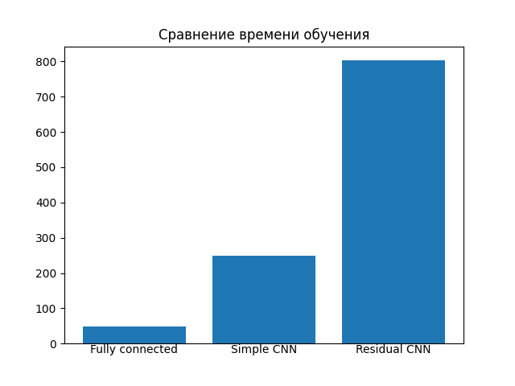

# Сравнение inference времени всех моделей:
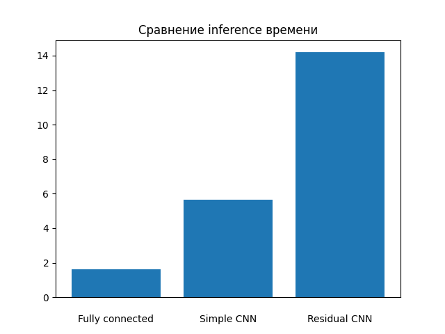

# Сравнение количества параметров fc и CNN моделей:
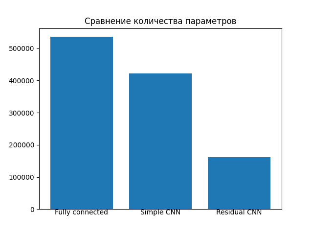

# Вывод:
# Чем сложнее модель, тем дольше она обучается, но при этом число параметров становится меньше. CNN с Residual Block показывает лучшую точность, но простая CNN работает почти так же хорошо на MNIST, а полносвязная сеть хуже справляется из-за переобучения.

# Задание 1.2

# Было проведено сравнение FC, Residual CNN и Regularized Residual CNN на CIFAR-10, вот полученные результаты:

# Точность моделей (в этот раз точность отличается сильнее, поэтому на графике разница будет более наглядна):
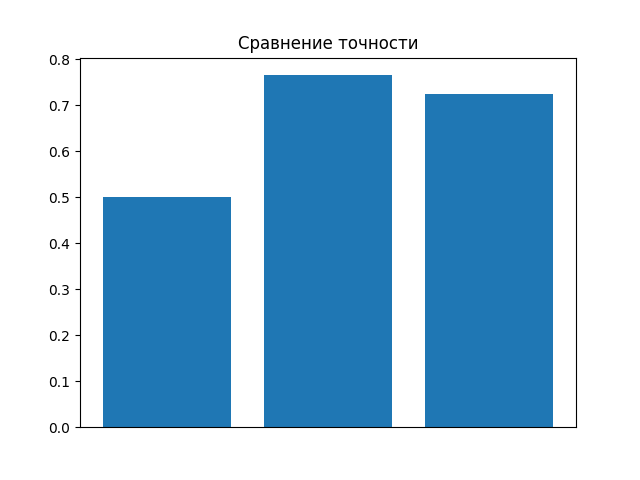

# Время обучения моделей (запускались на CPU, поэтому обучаются достаточно долго):
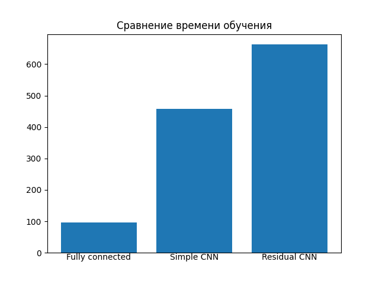

# Вывод:
# Время обучения CNN оказалось больше, чем у FC, но точность значительно выше. Переобучение у FC началось раньше, в то время как CNN, особенно с Residual блоками, показали более стабильные результаты.

# Задание 2.1

# Было изучено влияние размера ядра свертки на производительность CNN: сравнение 3×3, 5×5, 7×7 и комбинированных ядер:

# Точность моделей c разными размерами ядра свертки:

+--------+-------+--------+-----------+
|    3х3 |   5х5 |    7х7 |   1х1+3х3 |
+========+=======+========+===========+
| 0.9781 | 0.982 | 0.9821 |    0.9262 |
+--------+-------+--------+-----------+

# Время обучения моделей (запускались на CPU, поэтому обучаются достаточно долго):
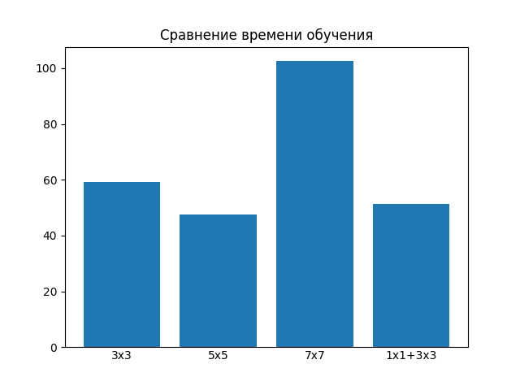

# Вывод:
# Мелкие ядра (3×3) быстрее и точнее на деталях, крупные (5×5, 7×7) лучше улавливают глобальные паттерны, но медленнее. Комбинация 1×1+3×3 даёт баланс скорости и точности на большей дистанции. Для большинства задач оптимальны 3×3 ядра.

# Задание 2.2

# Исследовано влияние глубины CNN на производительность, а также сравнение архитектур разной глубины с Residual связями:

# Точность моделей c разной глубиной свертки:

+--------------+-------------+-----------+----------+
|   ShallowCNN |   MediumCNN |   DeepCNN |   ResCNN |
+==============+=============+===========+==========+
|       0.9877 |       0.992 |     0.992 |   0.9881 |
+--------------+-------------+-----------+----------+

# Время обучения моделей (запускались на CPU, поэтому обучаются достаточно долго):
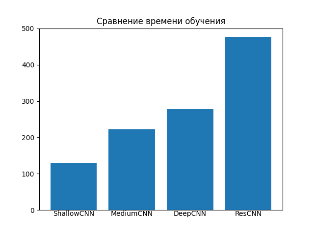

# Вывод:
# Глубина сети повышает точность, но требует Residual связей для борьбы с vanishing gradients. Оптимальная глубина зависит от сложности данных: 3-4 слоя для простых задач, 6+ с Residual связями - для сложных.

# Задание 3.1

# Не получилось обучить модель с кастомными слоями, почему-то выдавала одинаково плохой результат каждую эпоху, решил идти дальше, а не оставаться с этим заданием.

# Задание 3.2

# Сравнительный анализ Residual блоков: базовые, Bottleneck и Wide архитектуры (Всего две эпохи, потому что обучение было намного длиннее, чем на моделях из прошлых заданий)

# Сравнение количества параметров разных моделей:
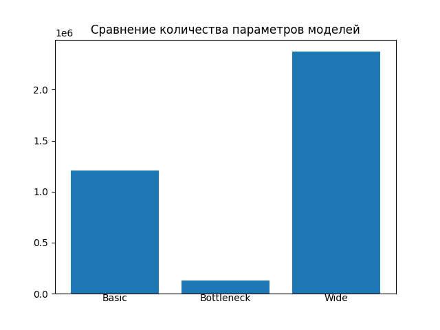

# Сравнение первой и второй модели:
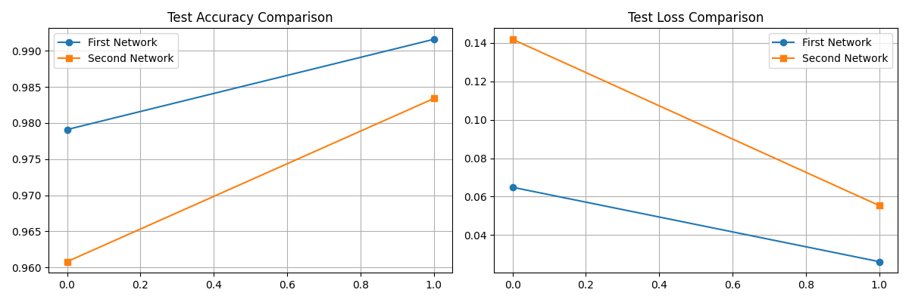

# Сравнение первой и третьей модели:
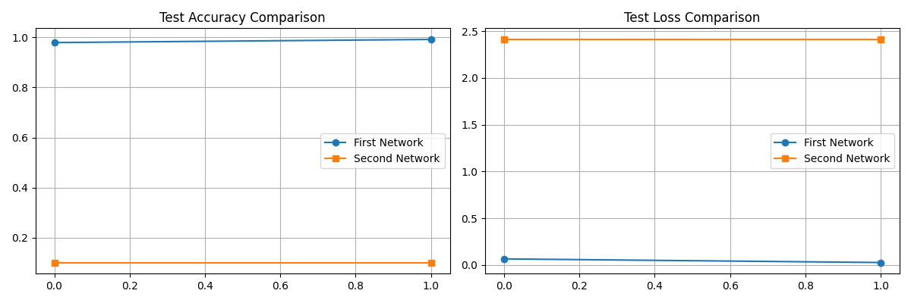

# Сравнение второй и третьй модели:
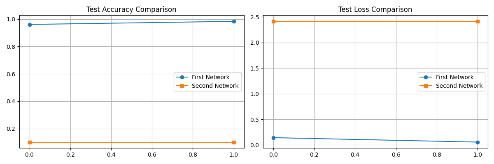

# Вывод:
# На малом количестве эпох базовая версия выигрывает в точности, но работает значительно дольше Bottleneck, Wide не запустилась, но в теории должна выдавать лучшие результаты, от чего время обучения увеличится ещё больше, количество параметров соответствует точности - в порядке возрастания: Bottleneck, Basic, Wide